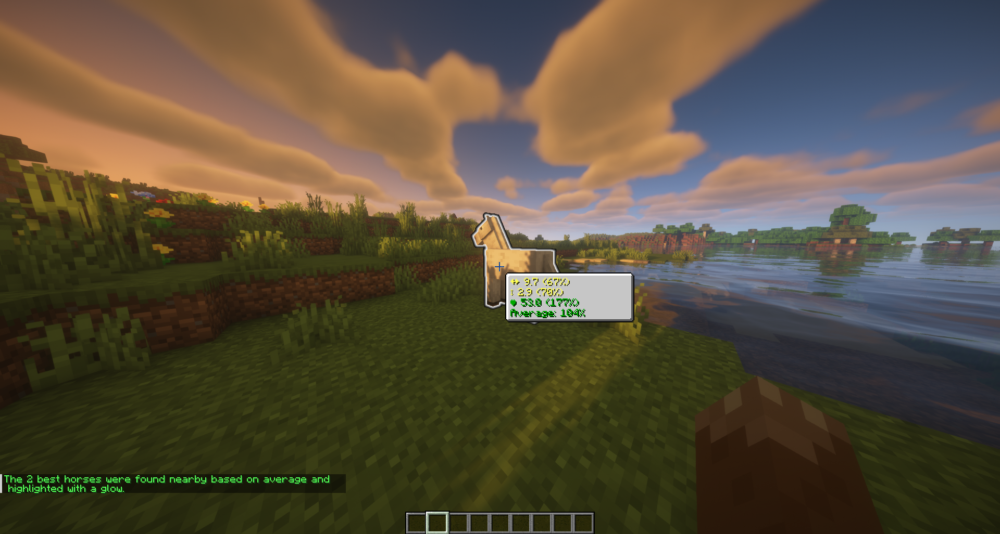
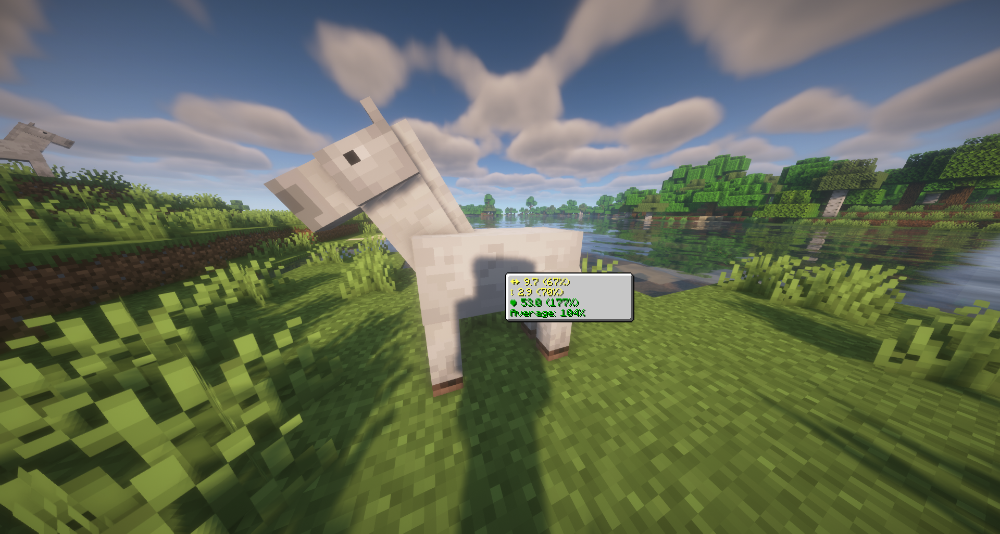
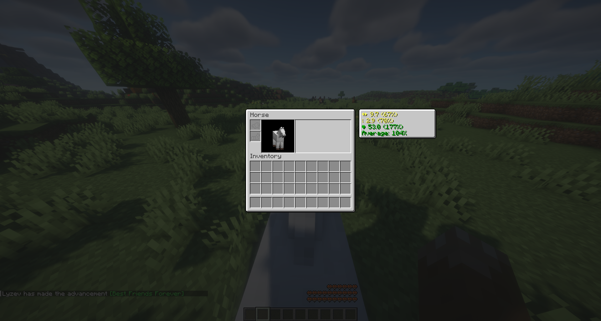
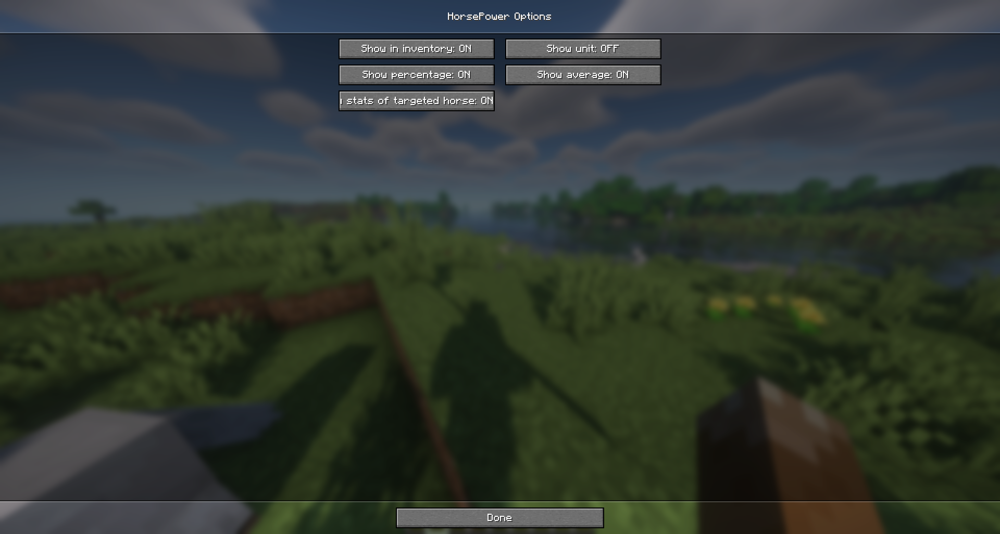

    

<h1 align="center">Horse Power</h1>

Ever wonder if your horse is more of a galloping champion or a pasture potato?

    
      
    
    
     
    
    
      
    
    

## Table of Contents

- [Why?](#why)
- [Installation](#installation)
    - [Client](#client)
    - [Server](#server)
- [Description](#description)
- [Screenshots](#screenshots)
- [Tips](#tips)
    - [Client](#client-1)
    - [Server](#server-1)
- [License](#license)
- [Security](#security)
- [Contributing](#contributing)
- [Bugs and Suggestions](#bugs-and-suggestions)
    - [Discord](#discord)
    - [GitHub](#github)

## Why?

Horse breeding in Minecraft can be challenging when it comes to evaluating a horse's worth. This project aims to
simplify that process by providing a tool to assess a horse's power based on its stats. It's particularly beneficial for
breeders who need to determine the value of their horses.

## Installation

### Client

1. Download the version of the mod, you need, from [Modrinth](https://modrinth.com/mod/horsepower).
2. Place the downloaded JAR file in the `mods` directory of your fabric instance.
3. Launch the game and enjoy the mod.

### Server

Installing the mod on a server is only necessary if you want to disable the search function (because it uses a glow effect, 
which could be seen as cheating). If you don't want to disable the search function, you can skip this section.

1. Download the version of the mod, you need, from [Modrinth](https://modrinth.com/mod/horse-power).
2. Place the downloaded JAR file in the `mods` directory of your server.
3. Launch the server and enjoy the mod.

## Description

This project is a handy tool for horse owners, designed to evaluate a horse's power (stats) based on movement speed,
jump height, and health. It is user-friendly and helps horse owners, especially breeders, to determine their horse's
value. Additionally, it includes a search function to find the best horse based on specific stats in your area.

## Features

- **HUD**: Displays the horse's power in the HUD.
- **Inventory**: Shows the horse's power in the inventory.

### Commands

- **/search <criteria> <amount>**: Searches for the best <amount> horses in the area based on the criteria.
    - Server opt-out available, see [Server](#server).
- **/stats**: Displays the stats of the horse you are currently looking at.

## Screenshots

**Search Command:**

**HUD, Inventory, and Settings:**

*Mod Menu is required to access the settings.*

## Tips

## Client

We recommend using the mod with the following mods to adjust settings and improve the overall experience:

- [Mod Menu](https://modrinth.com/mod/modmenu) - Allows you to adjust the mod's settings.

## Server

We recommend using our plugin for servers allowing players to breed better horses. This makes the breeding process more
efficient and enjoyable for players.

Modrinth: [Perfectly Balanced Horses](https://modrinth.com/plugin/perfectlybalancedhorses)  
GitHub: [Perfectly Balanced Horses](https://github.com/Lyzev/PerfectlyBalancedHorses)

## LICENSE

This project is licensed under the [AGPL-3.0 License](LICENSE).

## Security

If you discover a security vulnerability within this project, please refer to the [SECURITY.md](SECURITY.md) file for
more information on how to report it.

**Please do not disclose security-related issues publicly.**

*Note: This project is under AGPL-3.0 license, which means there is no warranty for this software. Use at your own risk.
See the [LICENSE](LICENSE) for more details.*

## Contributing

If you are interested in contributing to this project, please refer to the [CONTRIBUTING.md](CONTRIBUTING.md) file for
more information.

## Bugs and Suggestions

### Discord

For assistance with minor concerns, feel free to join our supportive community on
the [Discord server](https://lyzev.dev/discord). Our friendly members and staff are ready to help you.

### GitHub

To ensure a prompt and effective resolution of bugs or to share your suggestions, please submit them through
the [issue tracker](https://github.com/Lyzev/HorsePower/issues) of this repository. Kindly utilize the provided
templates
and make sure to include all relevant details that would help us understand your issue better. Your cooperation is
greatly appreciated.
